# Laboratorio 6.1: Despliegue de una Aplicación Web Estática con CI/CD ☁️

## 4. Práctica Individual 💻

### 1. Crea un nuevo repositorio en GitHub (público o privado) con un sitio web estático propio. El sitio web escogido fue el siguiente:

- Portafolio personal con Vite como framework estático.

### 2. El sitio web debe contener al menos:

- Una página principal (index.html).
- Hojas de estilo CSS personalizadas.
- Al menos un archivo JavaScript con interactividad básica.
- (Opcional) Múltiples páginas enlazadas entre sí.

Se ha construido el sitio web bajo la siguiente estructura:

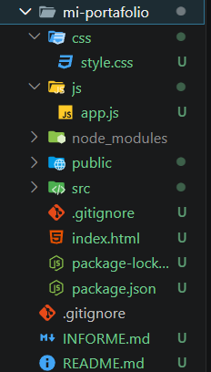

Una vez configurado el entorno, podemos visualizar localmente el sitio construido teniendo lo siguiente:

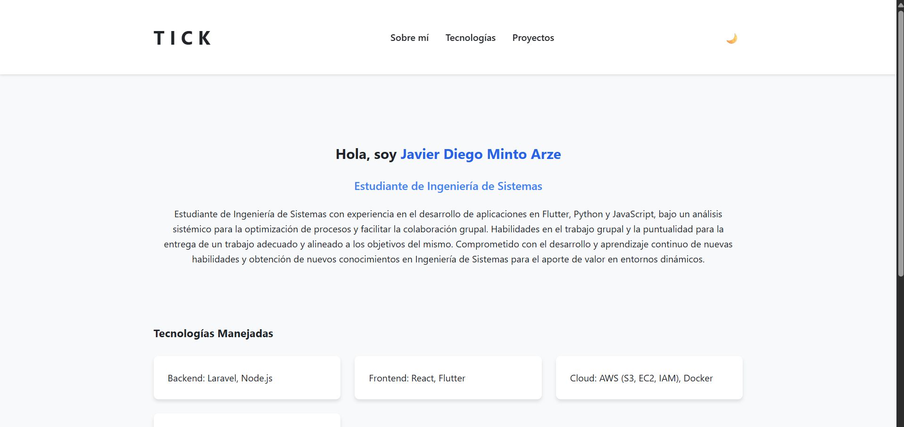

### 3. Configura un pipeline de despliegue continuo en GitHub Actions que incluya:

- Checkout del código.
- Configuración de credenciales AWS usando secrets.
- Sincronización con un bucket S3 propio usando aws s3 sync.
- Exclusiones adecuadas para no subir archivos innecesarios.

Para esto creamos dentro de la carpeta .github/workflows, un archivo llamado deploy.yml con el siguiente contenido:

```
name: Deploy Static Site to S3

on:
  push:
    branches: [main]

jobs:
  deploy:
    runs-on: ubuntu-latest

    steps:
      - name: Checkout del codigo
        uses: actions/checkout@v4

      - name: Configurar Node.js
        uses: actions/setup-node@v4
        with:
          node-version: 20

      - name: Instalar dependencias y compilar
        run: |
          npm install
          npm run build

      - name: Configurar credenciales de AWS
        uses: aws-actions/configure-aws-credentials@v4
        with:
          aws-access-key-id: ${{ secrets.AWS_ACCESS_KEY_ID }}
          aws-secret-access-key: ${{ secrets.AWS_SECRET_ACCESS_KEY }}
          aws-region: ${{ vars.AWS_REGION }}

      - name: Sincronizar archivos con S3
        run: |
          aws s3 sync ./dist s3://${{ vars.AWS_S3_BUCKET }} \
            --delete \
            --exclude ".git/*" \
            --exclude ".github/*" \
            --exclude "node_modules/*" \
            --exclude "README.md" \
            --exclude "package.json" \
            --exclude "package-lock.json"


```

### 4. Configura Amazon CloudFront:

- Crea una distribución con origen en tu bucket S3, ponemos como origen el bucket S3 creado:

  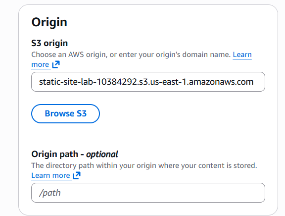

  Amazon Cloudfront es el siguiente:

  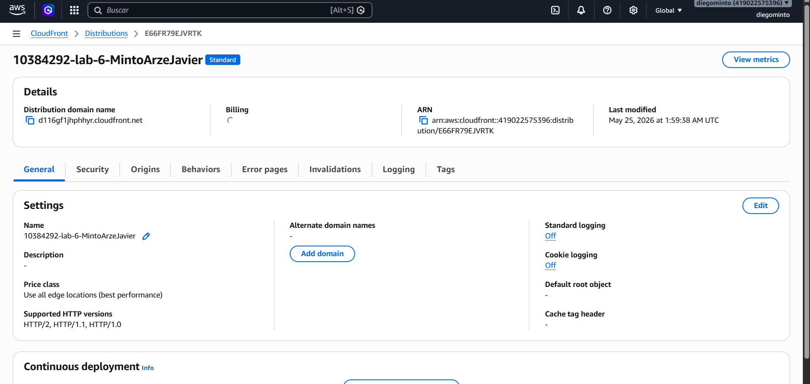

- Usa Origin Access Control (OAC) para restringir el acceso directo al bucket, tenemos configuado lo siguiente:

  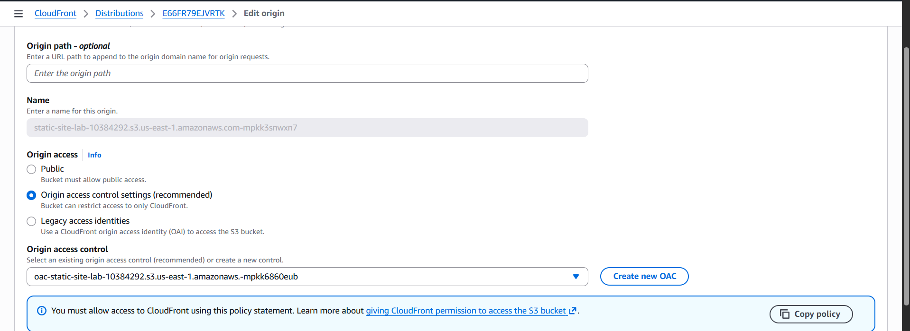

- Agrega un paso de invalidación de caché en tu workflow de GitHub Actions, agregamos lo siguiente:

```
      - name: Invalidar cache de CloudFront
        run: |
          aws cloudfront create-invalidation \
            --distribution-id ${{ vars.AWS_CLOUDFRONT_DISTRIBUTION_ID }} \
            --paths "/*"
```

- Documenta la URL de CloudFront (HTTPS) en tu informe.

El enlace es el siguiente: https://d116gf1jhphhyr.cloudfront.net/index.html

### 5. Crea un archivo INFORME.md en la raíz del repositorio que contenga:

Una breve descripción del sitio web y del pipeline configurado: Se realizó un portafolio web con el framework Vite, se le agregó un Modo Oscuro mediante manipulación dinámica del DOM y un sistema de modales para desplegar detalles específicos sobre proyectos realizados por mi persona. En cuanto al pipeline se tiene:

- El clonadodel código (actions/checkout@v4).

- Configuración de Node.js (actions/setup-node@v4).

- Instalación de dependencias y compilación de producción generando los recursos estáticos.

- Autenticación segura en la nube de AWS utilizando llaves del usuario IAM puestas en el repositorio.

- Sincronización atómica mediante aws s3 sync ./dist s3://... --delete excluyendo metadatos innecesarios de desarrollo (package.json, .git/\*, etc.).

- Invalidación automatizada de la caché global de Cloudfront sobre la ruta "/\*".

Capturas de pantalla que demuestren:

- El bucket S3 creado y configurado para hosting web

  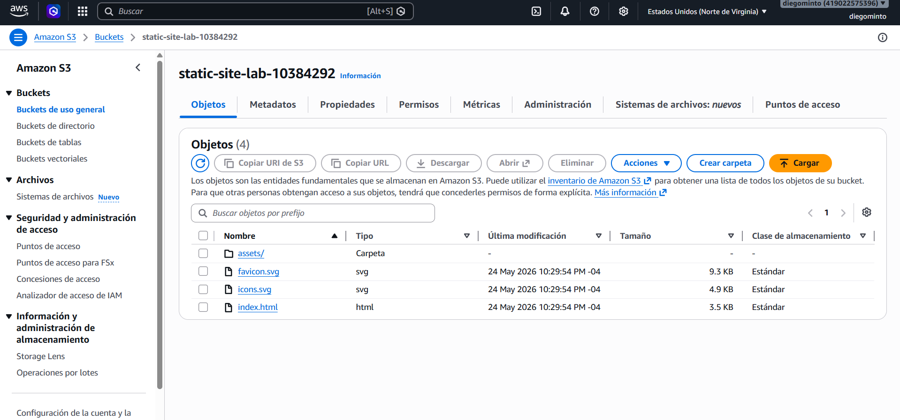
  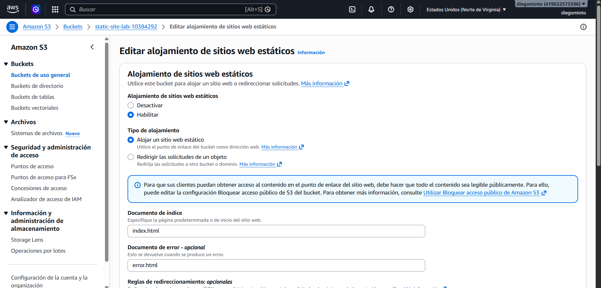

- Los secretos y variables configurados en GitHub, para esto se añadió una nueva variable para Cloudfront, también al usuario IAM se le dio permisos completos de Cloudfront, se usó el mismo usuario IAM creado en los ejercicios del laboratorio:

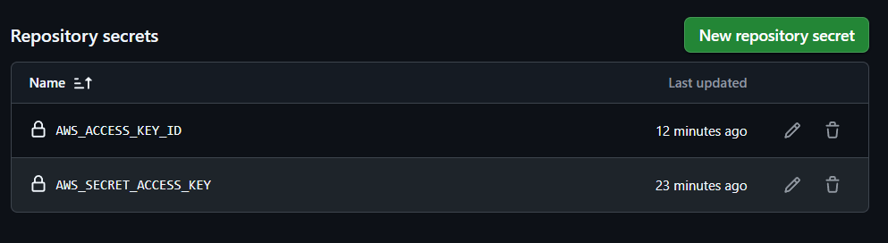
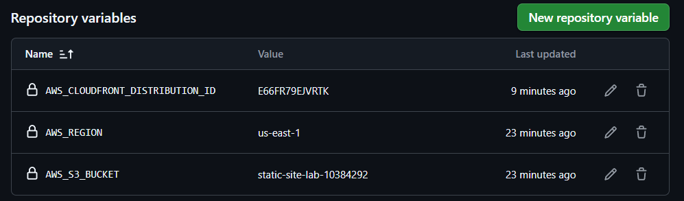

- El historial de ejecuciones en la pestaña Actions (al menos un éxito y un fallo intencional corregido), para esto se hizo una eliminación de las claves en el archivo deploy.yml afectando incluso la sintaxis del código siendo este el error que mostró github:

  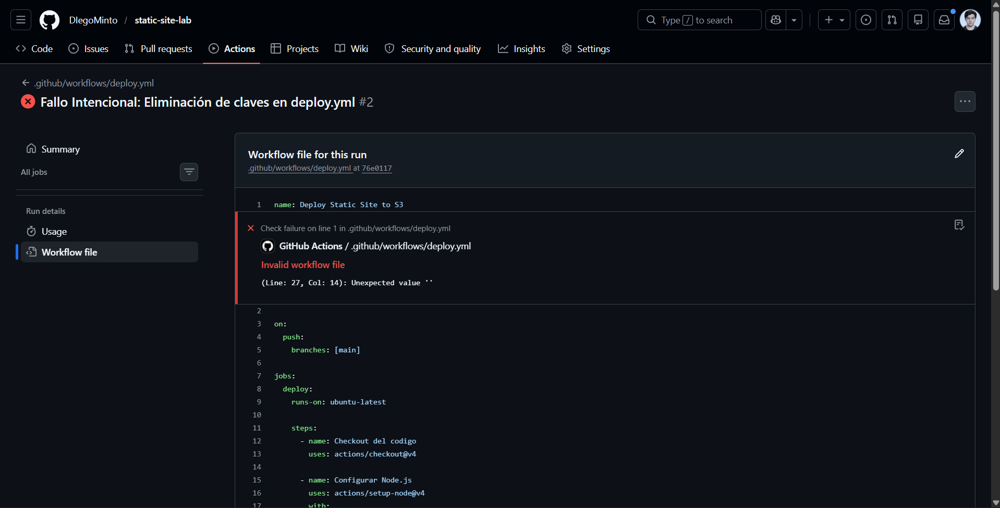
  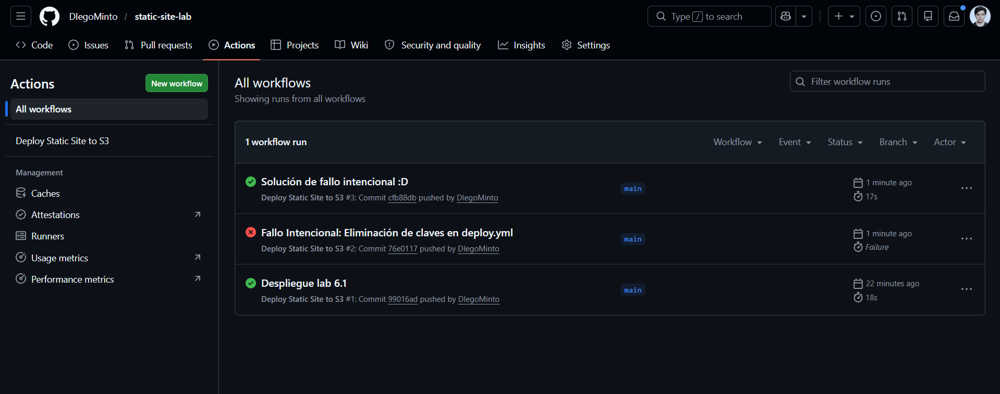

- El sitio web funcionando accesible públicamente (URL de S3 y CloudFront).

La URL de Cloudfront es la siguiente: https://d116gf1jhphhyr.cloudfront.net/index.html
La URL de S3 es la siguiente: http://static-site-lab-10384292.s3-website-us-east-1.amazonaws.com/

- La distribución de CloudFront configurada.


Origen del bucket S3 configurado:


OAC configurado:


- La URL pública completa donde se puede acceder al sitio web: https://d116gf1jhphhyr.cloudfront.net/index.html

- Conclusiones sobre la utilidad del despliegue continuo para sitios estáticos: Dadas las características de la nube podemos comprobar que el despliegue de webs estáticas es totalmente rápido y podemos poner una página web estática en producción casi al instante con las configuraciones correctas, además se debe destacar la seguridad de AWS donde se logra proteger el acceso al bucket de S3 mediante el OAC y las claves de acceso secretas, de igual forma la disponibilidad con AWS siempre está garantizada así como el código de producción gracias a Github actions donde se nos muestra el error a la hora de compilar e incluso podemos limitar el manejo de ramas.
